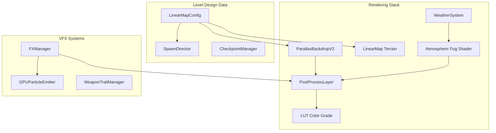

# Level Design, Graphics and Visual Overhaul Plan (9/10 Ambition)

## Current State Summary

The main_game is a 2D side-scrolling platformer (Shantae-style) with:

- **Parallax**: 7 procedural layers, time-of-day, 6 theme palettes
- **Terrain**: Procedural grass tufts, rocks, plants, pipes, lava bubbles, water ripples, toon lighting
- **Post-process**: Single-pass cinematic shader (bloom, cel, edge detection, lens distortion, per-theme presets)
- **Weather**: GPUParticles2D rain/snow/dust/clouds, light_shaft god rays
- **Level config**: `LinearMapConfig` with floor_segments, platforms, wall_segments, grapple_anchors, spawn zones, triggers, intensity curves

**Not yet implemented:** LUT color grading (`assets/luts/` empty), sprite-based parallax layers, secret areas/destructibles, volumetric fog, per-level visual identity.

---

## Phase 1: Rendering and Color Pipeline (Foundation)

### 1.1 LUT-Based Color Grading

- Create `assets/luts/` with 256x16 strip LUTs per theme (grass, cave, sky, summit, lava, ice)
- Add optional LUT pass to `post_cinematic.gdshader` or create `post_lut.gdshader` compositing pass
- Wire `PostProcessPipeline.set_theme_lut()` when theme changes; fallback to current lift/gamma/gain
- Files: `main_game/systems/post_process_pipeline.gd`, `main_game/systems/post_process_layer.gd`, new `assets/luts/*_lut.png`

### 1.2 HDR and Exposure

- Lower bloom threshold (0.32–0.38) for more overflow; add exposure slider driven by scene brightness (parallax sky vs cave)
- Expose `exposure_curve` and `exposure_shoulder` in post_cinematic for highlight rolloff (already in shader)
- Per-theme exposure in `main_game/systems/post_process_layer.gd` THEME_PRESETS

### 1.3 Quality Tiers

- Ensure `main_game/systems/quality_manager.gd` controls: internal resolution scale (0.85–1.0), bloom sample reduction, particle count
- Add runtime toggle from settings; persist in project settings

---

## Phase 2: Environmental Art and Atmosphere

### 2.1 Sprite-Based Parallax Layers

- Add `assets/parallax/` with imported hill/silhouette/cave PNGs (or generate placeholder procedurally)
- In `main_game/map/parallax_backdrop_v2.gd`: for far/mid/near layers, use tiled `TextureRect` or `Sprite2D` with `texture_repeat` when assets exist; fallback to procedural
- Foreground layer (0.98): GPUParticles2D for leaves/vines (theme-colored, 20–40 particles, emitting=true)

### 2.2 Atmospheric Fog and Depth

- Add `atmospheric_fog.gdshader`: fullscreen additive fog that increases with screen Y (simulates depth)
- Uniforms: `fog_color`, `fog_density`, `fog_start_y`, `fog_end_y` — theme-specific (strong in cave, light in sky)
- Apply as additional CanvasLayer pass below post-process or integrate into post_cinematic

### 2.3 Weather and Light Shafts Integration

- Ensure `main_game/systems/weather_system.gd` is initialized from `main_game/main_game.gd` per level theme
- Pass `time_of_day` from parallax to WeatherSystem for dawn/dusk light shaft intensity
- Light shaft `ray_origin` driven by sun position (e.g. 0.5 + 0.3*cos(time_of_day*TAU) for horizontal drift)
- Optional: rain/snow splash sub-emitters (GPUParticles2D sub_emitter)

### 2.4 Procedural Terrain Enhancement

- In `main_game/map/linear_map.gd`: increase grass density to 1.5x where theme=grass; add 2–3 normal-map variants via `TerrainTextureGenerator` (`(floor(x/64)+floor(y/64)) % 3`)
- Add 32x32 decal overlays (cracks, stains) at floor corners — `_decor_cracks` cache, drawn in `_draw()`
- Wind: secondary layer `cos(anim_time * 1.2) * 1.5` for grass (already partially present)

---

## Phase 3: Level Design Systems

### 3.1 Secret Areas and Destructibles

- `karen_defense/entities/level_destructible.gd` exists — wire into LinearMap via `obstacle_rects` with `can_destroy=true`
- Level config: `destructible_walls: [{x, y, w, h, hp, reward_type}]`; dash or ground pound breaks them
- `WallSegment` node with `hp`, `destroy_effect`; FXManager emits burst on destroy
- Secret passages: hidden grapple anchors, breakable walls revealing shortcuts

### 3.2 Alternate Routes

- Level config: `path_type: "high" | "low" | "main"` per segment
- High path: platforms, fewer enemies, optional collectibles
- Low path: more enemies, gold multiplier
- Visual differentiation: different platform sprites or accent colors

### 3.3 Collectibles and Keys

- `LevelLock` node: blocks progress until `key_count >= required`
- Keys: small pickup spawns in secret areas or high-path
- Checkpoint shop can sell keys as run modifier
- Config: `locks: [{x, y, required_keys}], key_spawns: [{x, y}]`

### 3.4 Per-Level Visual Identity

- Level config additions: `parallax_variant`, `time_of_day`, `weather_intensity`, `fog_preset`
- Example: Level 3 "Below" — cave theme, `time_of_day=0` (no sun), `fog_preset="dense"`
- Example: Level 5 "The Summit" — multi-biome: `parallax_variant` switches at segment boundaries
- LinearMapConfig: extend `_level_N()` dicts with these fields

---

## Phase 4: Combat and VFX Polish

### 4.1 Hitstop and Shake Curves

- In `main_game/main_game.gd`: `start_hitstop(duration, intensity)` — add per-hit-type lookup: Light=0.02s/0.5x, Medium=0.04s/1.0x, Heavy=0.08s/1.5x, Finisher=0.12s/2.0x
- Shake: per-axis decay (vertical 1.2x for landings)
- Haptics: `Input.start_joy_vibration()` on hit (0.2/0.4 for light, 0.6/0.8 for finisher)

### 4.2 GPU Particle Overhaul

- `main_game/systems/gpu_particle_emitter.gd`: ensure death bursts use GPUParticles2D (500+ particles)
- Sub-emitters: death burst spawns embers on expiration
- Color-over-lifetime gradient (hit_color → transparent)
- FXManager/CombatSystem: route `enemy_killed` to GPUParticleEmitter.spawn_death_burst(pos, color)

### 4.3 Impact Distortion and Flash

- Post_cinematic already has `impact_strength`, `impact_center`, `impact_direction`
- Ensure CombatSystem calls `post_process.trigger_impact_distortion(screen_pos, strength)` with correct `impact_direction` from hit
- Crit: one-frame fullscreen flash at 0.15 alpha via FXManager

### 4.4 Weapon Trail and Dash Afterimage

- WeaponTrailManager: use Polygon2D/Line2D ribbon, 12 sample points, width_curve taper
- Dash afterimage: player leaves 3–4 fading sprites (alpha 0.7→0) over 0.15s
- Store in player or dedicated trail node; draw in entity layer

---

## Phase 5: Level Content and Pacing

### 5.1 Segment Pacing Tuning

- `main_game/systems/spawn_director.gd`: `intensity_curve` already exists
- Add `intensity_curve` to each level in LinearMapConfig (e.g. intro=0.5, mid=1.0, boss_approach=1.3)
- Safe zone: 80px around checkpoint, no spawns; recovery window 15s
- Per-segment `spawn_density`, `enemy_pool`, `max_concurrent` — already in config; tune values

### 5.2 Biome Transitions

- For long levels (e.g. Level 5 "The Summit"): `segment_theme_overrides: [{x_min, theme}]`
- ParallaxBackdropV2: add `set_theme(theme)` and support mid-level theme switch when camera passes x_min
- Smooth crossfade (1–2 seconds) for parallax and post-process theme

### 5.3 Checkpoint and Economy Depth

- Tiered shop: first checkpoint = basic items; later checkpoints = advanced (lifesteal, magnet, double jump)
- Use `checkpoint_index` in CheckpointManager to gate shop inventory
- Risk/reward: "Curse" items (+50% damage taken, +40% gold) in ChallengeManager

---

## Phase 6: Camera and Framing

### 6.1 Boss and Danger Framing

- When boss detected: camera zoom out to 1.2x, center between player and boss
- When 4+ enemies on screen: slight zoom out (0.95x)
- Spring-damped zoom in main_game.gd; no snapping

### 6.2 Level Intro Cinematics

- First 2–3 seconds: subtle zoom from 1.05→1.0, slow pan to first checkpoint
- Optional: level name card + theme accent (handled in level_intro_timer)

---

## Phase 7: Accessibility and Performance

### 7.1 Accessibility

- Reduce motion: `shake_intensity *= 0.3`, `hitstop_duration *= 0.5`, speed lines off
- Color-blind LUT swap: deuteranopia/protanopia variants in `assets/luts/`
- Options menu toggles; persist in project settings

### 7.2 Streaming and Performance

- `main_game/systems/streaming_loader.gd`: preload critical (player, map, post_process); load parallax textures via `ResourceLoader.load_threaded_request`
- Level chunks: when camera.x > chunk_N.x + 400, load chunk N+1 (if level supports chunked loading)
- OcclusionManager: cull off-screen entities; reduce draw calls

---

## Architecture Overview

---

## Suggested Implementation Order

1. **Phase 1.1** (LUT) — High visual impact, low risk
2. **Phase 2.4** (Terrain) — Quick wins in linear_map.gd
3. **Phase 3.1** (Destructibles) — Gameplay + visual payoff
4. **Phase 2.2** (Fog) — Atmospheric depth
5. **Phase 4.1–4.3** (Hitstop, particles, impact) — Combat feel
6. **Phase 2.1** (Sprite parallax) — Requires asset creation
7. **Phase 3.4** (Per-level identity) — Content polish
8. **Phase 5** (Pacing, biome transitions) — Design iteration
9. **Phase 6–7** — Polish and accessibility

---

## Key Files Reference

| Component     | Primary File |
| ------------- | ------------ |
| Parallax      | `main_game/map/parallax_backdrop_v2.gd` |
| Terrain       | `main_game/map/linear_map.gd` |
| Post-process  | `main_game/systems/post_process_layer.gd`, `assets/shaders/post_cinematic.gdshader` |
| Level config  | `main_game/data/linear_map_config.gd` |
| Weather       | `main_game/systems/weather_system.gd` |
| Spawn         | `main_game/systems/spawn_director.gd` |
| FX            | `main_game/systems/fx_manager.gd` |
| Destructibles | `karen_defense/entities/level_destructible.gd` |
